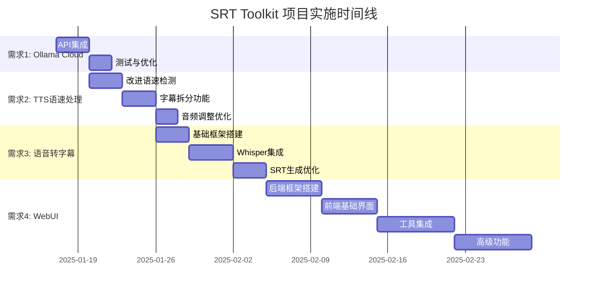

# SRT Toolkit 技术设计文档

## 1. 更新模型调用逻辑，增加Ollama Cloud模型的调用能力

### 1.1 当前实现分析

当前的模型调用逻辑主要在 [`srt_translator.py`](e:/project/srt-translator/srt_translator.py:1) 中的 `SFClient` 类实现，它使用标准的OpenAI兼容API格式。

### 1.2 Ollama Cloud API 集成设计

#### API配置结构
在 [`consts.py`](e:/project/srt-translator/consts.py:1) 中添加Ollama Cloud配置：

```python
"ollama_cloud": [
    {
        "TYPE": "llama3.1:8b",
        "DEFAULT_API_KEY": 'your_ollama_cloud_api_key',
        "API_ENDPOINT": "https://api.ollama.cloud/v1/chat/completions",
        "MODEL": "llama3.1:8b",
        "PRICE_PER_100M": 0
    },
    {
        "TYPE": "llama3.1:70b",
        "DEFAULT_API_KEY": 'your_ollama_cloud_api_key',
        "API_ENDPOINT": "https://api.ollama.cloud/v1/chat/completions",
        "MODEL": "llama3.1:70b",
        "PRICE_PER_100M": 0
    }
]
```

#### 代码实现要点
1. 确认Ollama Cloud API是否与OpenAI API格式兼容
2. 如有必要，在 `SFClient` 类中添加Ollama特定的请求/响应处理逻辑
3. 添加错误处理，针对Ollama Cloud特有的错误代码

#### 测试计划
1. 测试基本翻译功能
2. 测试重试机制
3. 测试不同模型大小的性能

## 2. 解决SRT TTS语音合成中，当字幕语速过快时的处理逻辑问题

### 2.1 当前实现分析

当前 [`srt_tts.py`](e:/project/srt-translator/srt_tts.py:1) 中的语速处理主要在以下方法中：
- [`detect_optimal_speed()`](e:/project/srt-translator/srt_tts.py:132)：检测最优语速
- [`adjust_audio_duration()`](e:/project/srt-translator/srt_tts.py:315)：调整音频时长

### 2.2 改进设计

#### 改进的语速检测算法
1. 更精确的语速计算，考虑标点符号和停顿
2. 动态调整语速阈值，根据字幕内容复杂度
3. 添加字幕拆分逻辑，当单句字幕过长时

#### 字幕拆分功能
```python
def split_long_subtitle(self, subtitle, max_duration=5.0):
    """拆分过长的字幕"""
    # 实现逻辑：根据标点、语义和时长限制拆分字幕
    pass
```

#### 改进的音频时长调整
1. 多级atempo滤镜应用，避免单一滤镜的失真
2. 音频质量保护，防止过度加速导致的质量下降
3. 智能静音填充，确保音频与字幕时间轴对齐

### 2.3 实现计划
1. 改进语速检测算法
2. 实现字幕拆分功能
3. 优化音频时长调整逻辑
4. 添加大量测试用例，覆盖各种边界情况

## 3. 添加一个利用Whisper来实现语音（视频）转字幕的工具

### 3.1 整体架构设计

创建新文件 `speech_to_srt.py`，包含以下主要组件：
- `AudioProcessor`: 音频预处理
- `WhisperTranscriber`: Whisper API调用
- `SRTGenerator`: SRT文件生成
- `CommandLineInterface`: 命令行接口

### 3.2 详细设计

#### 音频处理器
```python
class AudioProcessor:
    def extract_audio_from_video(self, video_path):
        """从视频中提取音频"""
        pass
    
    def preprocess_audio(self, audio_path):
        """音频预处理：降噪、标准化等"""
        pass
    
    def split_audio(self, audio_path, chunk_length=30):
        """将长音频分割为小块"""
        pass
```

#### Whisper转录器
```python
class WhisperTranscriber:
    def __init__(self, api_key, model="whisper-1"):
        self.api_key = api_key
        self.model = model
    
    def transcribe_audio(self, audio_path, language=None):
        """转录音频文件"""
        pass
    
    def transcribe_with_timestamps(self, audio_path, language=None):
        """带时间戳的转录"""
        pass
```

#### SRT生成器
```python
class SRTGenerator:
    def __init__(self, max_chars_per_line=42):
        self.max_chars_per_line = max_chars_per_line
    
    def generate_srt(self, transcript_data):
        """生成SRT格式字幕"""
        pass
    
    def optimize_line_breaks(self, text):
        """优化换行位置"""
        pass
```

### 3.3 实现计划
1. 实现基本的音频处理功能
2. 集成Whisper API
3. 实现SRT生成逻辑
4. 添加命令行接口
5. 优化性能和错误处理

## 4. 整合项目中的所有工具，形成一个WebUI集

### 4.1 技术栈选择

建议使用以下技术栈：
- 后端：FastAPI（高性能、自动API文档生成）
- 前端：Vue.js 3 + TypeScript（现代化、响应式）
- 数据库：SQLite（轻量级，易于部署）
- 任务队列：Celery + Redis（处理长时间运行的任务）

### 4.2 系统架构设计

```
┌─────────────────┐    ┌─────────────────┐    ┌─────────────────┐
│   前端 (Vue.js) │    │  后端 (FastAPI) │    │  工作进程 (Celery)│
│                 │    │                 │    │                 │
│ - 项目管理      │◄──►│ - REST API      │◄──►│ - 字幕翻译       │
│ - 任务监控      │    │ - 认证授权      │    │ - 语音合成       │
│ - 参数配置      │    │ - 任务队列      │    │ - 视频处理       │
│ - 结果预览      │    │ - 文件管理      │    │ - 语音转字幕     │
└─────────────────┘    └─────────────────┘    └─────────────────┘
         │                       │                       │
         └───────────────────────┼───────────────────────┘
                                 │
                    ┌─────────────────┐
                    │  数据库 (SQLite) │
                    │                 │
                    │ - 项目信息      │
                    │ - 任务状态      │
                    │ - 用户配置      │
                    │ - 历史记录      │
                    └─────────────────┘
```

### 4.3 数据模型设计

#### 项目模型
```python
class Project(Base):
    __tablename__ = "projects"
    
    id = Column(Integer, primary_key=True, index=True)
    name = Column(String, index=True)
    description = Column(String)
    created_at = Column(DateTime, default=datetime.utcnow)
    updated_at = Column(DateTime, default=datetime.utcnow, onupdate=datetime.utcnow)
    tasks = relationship("Task", back_populates="project")
```

#### 任务模型
```python
class Task(Base):
    __tablename__ = "tasks"
    
    id = Column(Integer, primary_key=True, index=True)
    project_id = Column(Integer, ForeignKey("projects.id"))
    type = Column(String)  # translation, tts, speech_to_text, video_processing
    status = Column(String)  # pending, running, completed, failed
    parameters = Column(JSON)  # 任务参数
    result_path = Column(String)  # 结果文件路径
    created_at = Column(DateTime, default=datetime.utcnow)
    started_at = Column(DateTime)
    completed_at = Column(DateTime)
    project = relationship("Project", back_populates="tasks")
```

### 4.4 API设计

#### 项目管理API
- `GET /api/projects` - 获取项目列表
- `POST /api/projects` - 创建新项目
- `GET /api/projects/{id}` - 获取项目详情
- `PUT /api/projects/{id}` - 更新项目
- `DELETE /api/projects/{id}` - 删除项目

#### 任务管理API
- `GET /api/projects/{project_id}/tasks` - 获取项目任务列表
- `POST /api/projects/{project_id}/tasks` - 创建新任务
- `GET /api/tasks/{id}` - 获取任务详情
- `GET /api/tasks/{id}/status` - 获取任务状态
- `DELETE /api/tasks/{id}` - 取消任务

#### 工具API
- `POST /api/tools/translate` - 字幕翻译
- `POST /api/tools/tts` - 语音合成
- `POST /api/tools/speech-to-text` - 语音转字幕
- `POST /api/tools/video-process` - 视频处理

### 4.5 前端界面设计

#### 主要页面
1. **仪表板**：项目概览、任务统计、最近活动
2. **项目管理**：项目列表、创建/编辑项目
3. **任务管理**：任务队列、进度监控、结果查看
4. **工具页面**：各工具的专用界面，参数配置
5. **设置页面**：全局设置、API配置

#### 组件设计
1. **文件上传组件**：支持拖拽上传、批量上传
2. **进度监控组件**：实时显示任务进度、日志
3. **参数配置组件**：动态表单、参数验证
4. **结果预览组件**：字幕预览、音频播放、视频预览

### 4.6 实现计划

#### 第一阶段：基础框架
1. 搭建FastAPI后端框架
2. 实现基础认证和项目管理
3. 创建Vue.js前端项目结构
4. 实现基础UI组件

#### 第二阶段：核心功能
1. 集成字幕翻译工具
2. 集成语音合成工具
3. 实现任务队列系统
4. 添加文件管理功能

#### 第三阶段：完整功能
1. 集成语音转字幕工具
2. 集成视频处理工具
3. 实现高级项目管理功能
4. 添加实时监控和日志

#### 第四阶段：优化和部署
1. 性能优化和错误处理
2. 添加单元测试和集成测试
3. 部署文档和容器化
4. 用户手册和文档完善

## 5. 项目实施时间线



## 6. 风险评估与缓解策略

### 6.1 技术风险
1. **API兼容性问题**：不同API格式可能不兼容
   - 缓解策略：创建适配器模式，统一接口
   
2. **性能瓶颈**：长时间运行任务可能导致性能问题
   - 缓解策略：实现任务队列，异步处理

3. **资源限制**：音频/视频处理需要大量计算资源
   - 缓解策略：实现资源监控和限制机制

### 6.2 项目风险
1. **范围蔓延**：功能需求可能不断扩大
   - 缓解策略：明确优先级，分阶段实现

2. **依赖变化**：外部API可能发生变化
   - 缓解策略：使用稳定版本，实现降级机制

3. **数据安全**：用户上传的媒体文件需要安全处理
   - 缓解策略：实现文件加密和访问控制

## 7. 总结

本技术设计文档详细规划了SRT Translator项目的四个主要需求实现方案。通过分阶段实施，可以确保项目稳步推进，同时保持代码质量和系统稳定性。建议按照优先级顺序实现各个功能，并在每个阶段进行充分测试和优化。